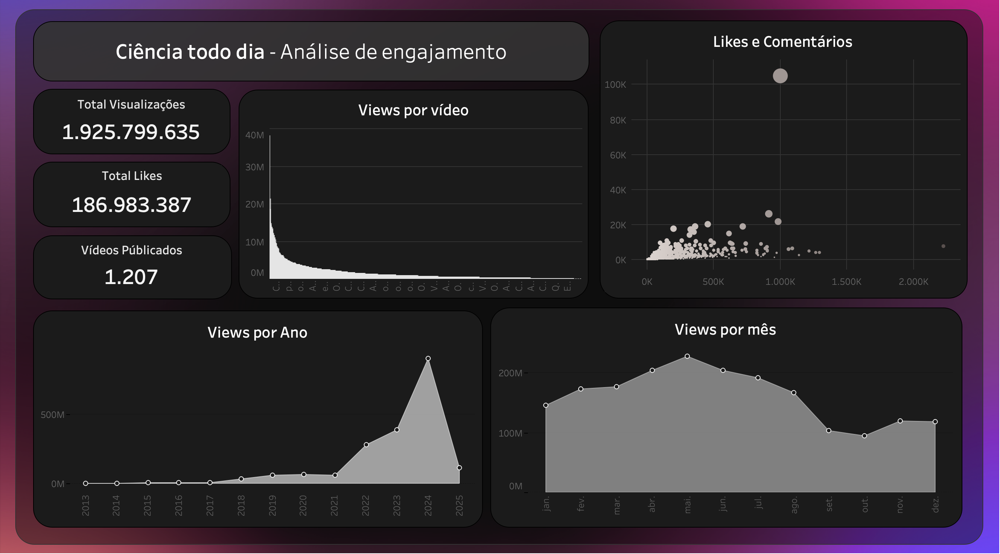

# 📊 Dashboard YouTube – Análise de Engajamento (Ciência Todo Dia)

Este projeto apresenta uma **análise completa de engajamento do canal "Ciência Todo Dia" no YouTube**, explorando métricas de desempenho ao longo do tempo.  
O objetivo é transformar dados brutos em **insights visuais claros e objetivos**, destacando o crescimento do canal e os padrões de audiência.

---

## 🧠 Objetivo
Criar um **dashboard de dados** para visualizar métricas de engajamento no YouTube, utilizando Python e ferramentas de análise visual.  
O foco foi entender como o canal evoluiu ao longo dos anos e como as interações (likes, comentários e visualizações) se relacionam entre si.

---

## 📈 Indicadores Principais
- **Total de Visualizações:** 1.925.799.635  
- **Total de Likes:** 186.983.387  
- **Vídeos Publicados:** 1.207  
- **Período analisado:** 2013–2025  

---

## 🧩 Visualizações do Dashboard
O painel exibe as seguintes análises:
- **Views por vídeo:** distribuição geral das visualizações de cada publicação.  
- **Likes e Comentários:** relação entre engajamento e alcance.  
- **Views por ano:** crescimento histórico do canal.  
- **Views por mês:** comportamento sazonal de audiência.

---

## 🛠️ Tecnologias Utilizadas
- **Python**
- **Pandas** — manipulação e limpeza de dados  
- **Matplotlib / Seaborn / Plotly** — criação das visualizações  
- **Jupyter Notebook** — ambiente de desenvolvimento e apresentação  

---

## 🔁 Atualização dos Dados
O dashboard foi desenvolvido para se atualizar com novos dados de forma simples:
1. Substitua o arquivo `dataset_youtube.csv` por uma nova versão atualizada.  
2. Execute novamente o script `dashboard.ipynb` (ou `dashboard.py`).  
3. As métricas e gráficos são atualizados automaticamente.  

Se desejar automatizar completamente, é possível integrar com **Google Sheets** via API e agendar a execução com **cron** (macOS/Linux) ou **Task Scheduler** (Windows).

---

## 💡 Principais Insights
- O canal teve **crescimento acelerado em 2023 e 2024**, atingindo picos históricos de visualizações.  
- Existe **alta concentração de visualizações em poucos vídeos**, o que indica conteúdo viral.  
- O engajamento tende a ser maior entre **abril e junho**, possivelmente relacionado ao calendário de postagens.  
- A relação entre **likes e comentários** confirma alta interação da comunidade científica e curiosa do canal.  

---

## 👨‍💻 Autor
**Luiz Brito**  
 [LinkedIn](https://www.linkedin.com/in/luiizbrt/)  

---

## 📸 Preview

